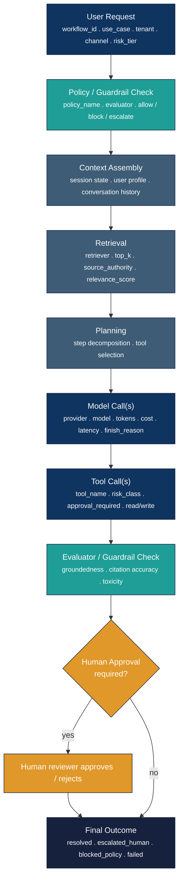
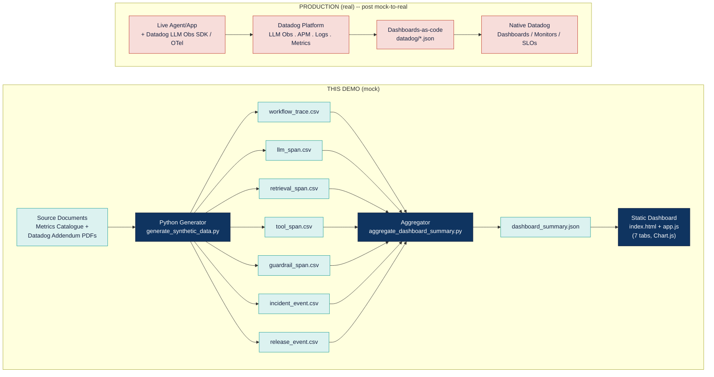
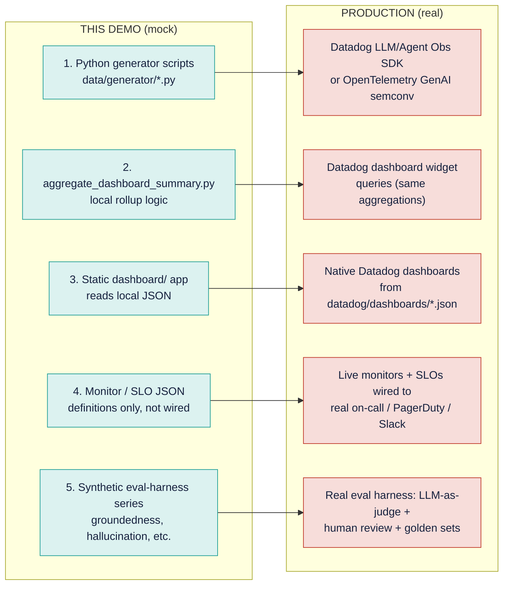
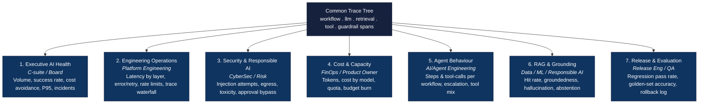
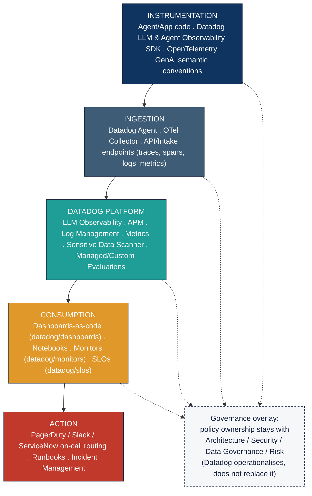

# Architecture diagrams

Six diagrams supporting the training material, in two forms:

- **`mermaid/*.mmd`** — GitHub-native source. Rendered automatically below and directly on GitHub wherever these files are linked or embedded in a fenced ` ```mermaid ` block.
- **`exports/*.png`** — high-resolution rasters of the same content, used in the two PowerPoint decks (`../slides/`) and the consolidated Word training guide (`../docx/`).

If you edit a diagram, update both: the `.mmd` source for GitHub/dev-facing use, and re-export a PNG for slide/doc use (no build tool wires these together automatically — treat them as a matched pair to keep in sync by hand).

## 1. Observability trace-tree architecture

Every workflow is one connected trace, not isolated logs — the architectural principle underpinning every dashboard in this repo.



## 2. Demo data flow — synthetic telemetry pipeline (mock)

How this repo's mock pipeline is generated, and its real-implementation counterpart.



## 3. Mock to real migration

What changes and what carries over unchanged, per `docs/datadog-mapping.md`.



## 4. 90-day roadmap timeline

```mermaid
timeline
    title 90-Day Path to Production Capability
    section Weeks 0-2 : Foundation -- DONE (mock)
        Telemetry contract : Tag taxonomy : Risk tiers : First pilot workflow
    section Weeks 3-6 : Operate -- DONE (mock)
        7 dashboards built : SLOs/monitors defined : 3 seeded incident stories
    section Weeks 7-10 : Govern -- PARTIAL
        Real eval harness (gap) : DLP / Sensitive Data Scanner (gap) : Human-review telemetry (partial)
    section Weeks 11-13 : Scale -- NOT STARTED
        Reusable instrumentation library : Onboarding checklist : Golden dashboards
```

## 5. Dashboard information architecture



## 6. Target Datadog implementation architecture


