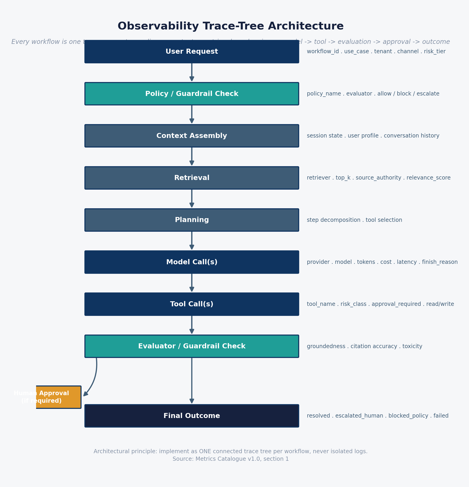
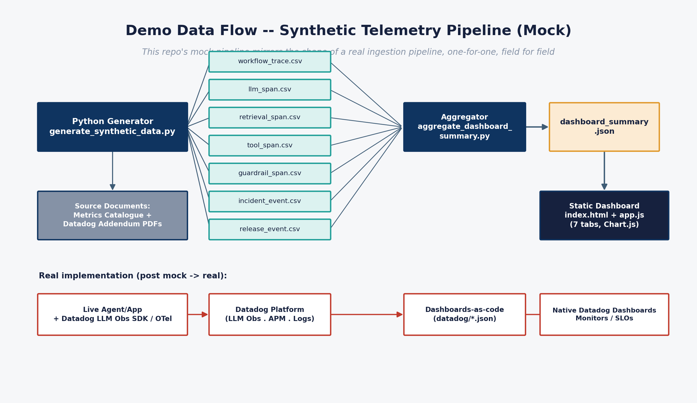

# 1. What this demo is

## Purpose

This repository is a **portfolio reference architecture**: a working, fully-mocked demonstration of how to observe agentic Gen AI workflows in production, built to support architecture-board, risk-committee and Community of Practice conversations ahead of a real Datadog implementation. Nothing in it is connected to a live system — every number, trace and incident is generated by a Python script (`data/generator/`).

It exists to answer a question every enterprise adopting agentic Gen AI eventually has to answer: **what does "observability" mean for a system that can call tools, move money, retrieve from external sources, and occasionally hallucinate — and how do you actually build that on a platform like Datadog, not just describe it in a slide?**

## Why conventional APM isn't enough

A Gen AI agent can return an HTTP 200 and still have failed. Conventional application monitoring (uptime, latency, error rate) misses the failure modes that matter most for agentic systems:

| Conventional APM sees | Agentic Gen AI actually needs to catch |
|---|---|
| Request succeeded (200 OK) | Was the *business outcome* achieved, or did the agent silently produce a wrong or ungrounded answer? |
| Latency within SLA | Was cost within budget — did the workflow quietly burn 10x the expected tokens? |
| No application errors | Did a prompt-injection attempt bypass a guardrail and reach a money-moving tool? |
| Server didn't crash | Did an agent loop fan out into 40 tool calls before anyone noticed? |
| — | Was a human review or approval step actually exercised where policy required it? |

This is the gap the two source documents address, and the gap this demo operationalises: cost, reliability, performance, agent behaviour, security and responsible-AI risk, all correlated by trace, in one observability model.

## The two source documents

Everything in this repository traces back to two internal source documents (kept private, not published in this repo):

- **AI Observability Metrics Catalogue for Agentic LLM Workflows** (v1.0, 30 Jun 2026) — the *what to measure and govern* baseline. Roughly 150 metrics across 13 measurement dimensions (cost, performance, scale, reliability, agent behaviour, RAG/grounding, security, responsible AI, incidents, model quality/drift, data/privacy, change/release, and an executive view spanning all of them). Condensed in [`docs/metrics-catalogue.md`](../../docs/metrics-catalogue.md).
- **AI Observability — Datadog Implementation Addendum** — the *how to implement it on Datadog* companion. Telemetry contract, seven-dashboard pack, SLOs, and a 90-day roadmap. Mapped in [`docs/datadog-mapping.md`](../../docs/datadog-mapping.md) and [`docs/roadmap.md`](../../docs/roadmap.md).

## The demo scenario

**Order Support & Returns Assistant** — an agentic retail customer-service workflow (order status, returns, refunds, loyalty credits, address changes) operating across three storefront brands, over a synthetic 30-day window (1 – 30 June 2026). This scenario was chosen deliberately because it exercises every dimension that matters for a governance-facing demo:

- **Cost at scale** — thousands of workflows a month, real token/tool cost economics.
- **Tool-driven side effects** — refunds move money; this is not a read-only chatbot.
- **A believable attack surface** — prompt injection against a `refund_issue` tool is a realistic, high-stakes adversarial scenario, not a contrived one.

### Three seeded storylines

Three incidents are deliberately built into the synthetic data so the dashboards show a diagnosable signal, not noise — each one is a rehearsal for a real production scenario:

| Event | What happened | Why it's here |
|---|---|---|
| **REL-2026-0608 / REL-2026-0609** | A prompt version bump (v14 → v15) degraded groundedness and citation accuracy; caught by the (synthetic) evaluation harness and rolled back roughly 27 hours later | Demonstrates the Release & Evaluation dashboard's core job: catching a regression before it becomes a quality incident, and showing the eval-gate → rollback loop working |
| **INC-2026-0611** (Sev2) | A cluster of prompt-injection attempts targeting the `refund_issue` tool; the guardrail caught 92%, a handful bypassed | Demonstrates the security dashboard's core job: catching an adversarial pattern and quantifying exactly what got through |
| **INC-2026-0621** (Sev1) | A promo-driven traffic surge triggered provider rate-limiting, forcing retries and fallback-model routing, spiking latency and cost | Mirrors Datadog's own published finding that provider rate limits are a material share of production LLM failures — this is the "boring but common" incident, not a hypothetical |

## Headline numbers from the current synthetic run

| Metric | Value |
|---|---|
| Workflows (30 days) | ~5,100 |
| Success rate | ~95% |
| Cost per successful workflow | ~$0.025 |
| Forecasted monthly AI run-rate | ~$120 (against a $150 assumed budget) |
| Estimated monthly cost avoidance vs. human-handled equivalent* | ~$31,400 |
| Incidents | 2 (1 Sev1, 1 Sev2) + 1 release rollback |

*Illustrative only — assumes a $6.50 fully-loaded cost per human-handled contact, a modelling assumption for this demo, not a sourced benchmark. Regenerating the data will reproduce slightly different exact figures (the generator uses randomised-but-seeded distributions).

## What "done" means for this v1

All 7 dashboards from the Datadog addendum's pack are built and populated. The synthetic data pipeline mirrors, field for field, the shape of a real Datadog ingestion pipeline — see [`02-dashboard-user-guide.md`](02-dashboard-user-guide.md) for how to read the dashboards, and [`03-architecture-and-caveats.md`](03-architecture-and-caveats.md) for exactly what is and isn't modelled honestly in this v1.

## Related diagrams

**Diagram — observability trace-tree architecture** (the principle behind every dashboard):

**Diagram — demo data flow, synthetic telemetry pipeline** (how the synthetic data is generated and consumed):

