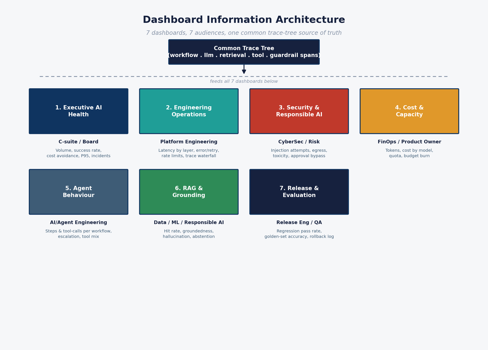

# 2. How to use the dashboard

## Getting it running

The dashboard is a static HTML/CSS/JS app (Chart.js via CDN) — no build step, no server-side code.

```bash
cd genai-observability-demo/dashboard
python3 -m http.server 8000
# open http://localhost:8000
```

Browsers block `fetch()` of local JSON over `file://`, so it must be served (locally, or via GitHub Pages — `dashboard/` is fully static and Pages-ready). If you want to regenerate the underlying synthetic data first:

```bash
cd genai-observability-demo/data/generator
python3 generate_synthetic_data.py        # writes data/synthetic/raw/*.csv
python3 aggregate_dashboard_summary.py    # writes dashboard/data/dashboard_summary.json
```

Every screen carries a **"MOCK / SYNTHETIC DATA"** pill in the header — keep that visible in any live demo or screen-share; it's the honesty mechanism that makes this useful in a governance conversation rather than misleading in one.

## Navigation model

Seven tabs across the top, one per dashboard in the addendum's pack. All read from a single pre-aggregated file, `dashboard/data/dashboard_summary.json`, itself built from the raw trace-tree span data (`data/synthetic/raw/*.csv`) by the aggregator script. See the [dashboard information architecture diagram](../diagrams/exports/05-dashboard-information-architecture.png) below for how the seven map to audiences.

### Tab 1 — Executive AI Health

*Audience: C-suite, board, risk committee.*

- **KPI row**: workflow volume, success rate, cost per successful workflow, monthly run-rate, estimated cost avoidance vs. a human-handled equivalent, P95 latency, incident count.
- **Daily workflow volume by outcome** — resolved / failed / escalated / blocked, stacked by day.
- **Success rate (%) — daily trend** — watch for dips around the two seeded incidents.
- **Cost per successful workflow (USD) — daily trend** — the single number a CFO will ask about first.
- **Workflow volume by tenant (brand)** — adoption across the three storefront brands.
- **Cost composition — 30-day total by category** — LLM vs. tool vs. retrieval cost.
- **Incident log (Sev1/Sev2)** — the two seeded incidents, in a format a risk committee would expect to see.

*How to present it:* this is the tab for a 2-minute exec walkthrough — lead with cost avoidance and success rate, point at the incident log to show detection is working, and stop there unless asked to go deeper.

### Tab 2 — Engineering Operations

*Audience: platform engineering, SRE.*

- **Latency by layer (P95, ms)** — decomposes end-to-end latency into model / retrieval / tool time, so an on-call engineer knows where to look first.
- **P50/P95/P99 latency trend** and **error/retry/timeout rate**.
- **Provider rate-limit events — daily** — this is where INC-2026-0621 (the Sev1) shows up as a spike.
- **Agent loop events — daily** — repeated tool-call sequences; a leading indicator of runaway agent behaviour.
- **Representative trace waterfall** — a single illustrative trace, decomposed into guardrail → retrieval → model (with a rate-limited retry + provider fallback) → tool steps. This is the closest thing in the static demo to a real APM/LLM-observability trace view.

### Tab 3 — Security & Responsible AI

*Audience: cybersecurity, risk, responsible-AI governance.*

- **Prompt injection attempts — blocked vs. bypassed (daily)** — this is where INC-2026-0611 shows up: a visible cluster of attempts, with the bypass count exposed rather than buried.
- **Sensitive data egress & toxicity flags — daily.**
- **High-risk tool calls & policy approval bypasses — daily.**
- **Incident spotlight — INC-2026-0611** — a narrative callout box walking through what happened, detection, and mitigation.

*Why this tab matters most for a risk committee:* it's the one place a "successful" workflow (agent responded, no application error) and a "safe" workflow are shown as two different things.

### Tab 4 — Cost & Capacity

*Audience: FinOps, product owner.*

- **Token usage — input vs. output (daily).**
- **Cost by model (daily, USD).**
- **Provider quota utilisation (%)** against an assumed daily LLM-call quota — the promo-driven rate-limit incident (days 21–22) shows up here as a quota breach.
- **Cumulative cost vs. monthly budget** — a budget-burn line.
- **Fallback-model cost uplift (daily, USD)** — the direct dollar cost of routing to a more expensive fallback model during the rate-limit incident; this is the number that turns "we had an outage" into "the outage cost us $X."

### Tab 5 — Agent Behaviour

*Audience: AI/agent engineering, product.*

- **Average step count / tool calls per workflow — daily** — a proxy for agent efficiency and scope creep.
- **Tool calls by name (30-day total)** — which tools the agent actually uses.
- **Human escalation rate (%) — daily** — the automation boundary in practice.
- **Tool call success rate (%)** — used here as a *proxy* for tool-selection quality, since this demo doesn't model ground-truth "correct tool for intent" labelling. Call this out explicitly if presenting to an audience that will ask for a real accuracy number.

### Tab 6 — RAG & Grounding Quality

*Audience: data/ML engineering, responsible-AI risk.*

- **Retrieval hit rate (%) — daily.**
- **Groundedness & citation accuracy — daily average.**
- **Hallucination rate (%)** and **abstention rate (%) — daily.**
- **Average retrieved-source freshness (days) — daily.**

**Read the fine print here.** Groundedness, citation accuracy, hallucination rate and abstention rate are generated as a **synthetic evaluation-harness series** — independent of the raw retrieval/model spans — because that's how a real implementation works too: evals run on a schedule against sampled traffic, scored by an LLM-as-judge or human reviewer, not computed inline on every request. See [`03-architecture-and-caveats.md`](03-architecture-and-caveats.md) for why this is a deliberate design choice, not a shortcut being passed off as something else.

### Tab 7 — Release & Evaluation

*Audience: release engineering, QA, MLOps.*

- **Regression pass rate & golden-set accuracy (%) — daily.**
- **Release / rollback log** — this is where the seeded prompt v14 → v15 regression and rollback (REL-2026-0608 / REL-2026-0609) appears as a concrete row, not an abstraction.

*Same caveat as tab 6 applies*: these scores come from the same synthetic evaluation-harness series, sampled on a schedule.

## Suggested walkthrough order for a training session

1. Start on **Executive AI Health** to set business context and headline numbers.
2. Jump to **Security & Responsible AI**, open the incident spotlight — this is usually the most attention-grabbing tab for a risk/governance audience.
3. Show **Engineering Operations**, specifically the trace waterfall, to ground the abstract "trace tree" concept in a concrete picture.
4. Show **Cost & Capacity** to connect the rate-limit incident to a dollar figure.
5. Close on **RAG & Grounding** or **Release & Evaluation**, explicitly flagging the synthetic-eval-harness caveat — this is where technical credibility is won or lost with a sophisticated audience.

## Related diagrams

**Diagram — dashboard information architecture** (7 dashboards, 7 audiences, one common trace-tree source of truth):


