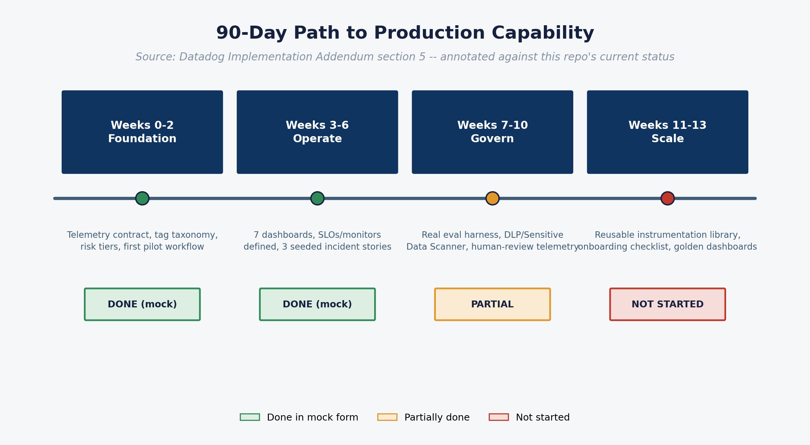

# 4. Roadmap and next steps

## The 90-day path to production capability

Source: *AI Observability — Datadog Implementation Addendum*, §5, annotated here against this repository's actual current status. See the timeline diagram below.

| Horizon | Goal | Core activities | Exit criteria | This repo's status |
|---|---|---|---|---|
| **Weeks 0–2 — Foundation** | Establish standards and one observable pilot | Define AI telemetry contract, tag taxonomy, data retention policy, redaction policy, risk tiers, approved model/tool registry, first instrumented workflow | One agentic workflow visible end-to-end with model spans, tool spans, token/cost/latency metrics and basic monitors | **Done in mock form.** Telemetry contract defined and matched to the addendum; one workflow (Order Support & Returns Assistant) fully instrumented — as synthetic data, not live traffic |
| **Weeks 3–6 — Operate** | Move from traces to operational control | Build dashboards for cost, latency, reliability, rate limits, agent loops, tool failures, safety evals; add SLOs, alert thresholds, runbooks, incident routing | Production support can detect, triage and assign AI workflow incidents via the platform, not manual log inspection | **Done in mock form.** All 7 dashboards built; SLO/monitor definitions stubbed but not wired to a real alerting channel; three seeded storylines demonstrate the detection → triage narrative but aren't live |
| **Weeks 7–10 — Govern** | Operationalise responsible AI and security controls | Integrate Sensitive Data Scanner/DLP, prompt-injection signals, custom evaluations, human-review telemetry, audit evidence, high-risk tool approval metrics | High-risk workflows have policy-decision telemetry, audit evidence, approval/override tracking, responsible AI dashboards | **Partially done.** Guardrail/policy-decision telemetry, approval-bypass tracking and a mocked evaluation-harness series are all modelled. Still not modelled: a real eval harness, bias/fairness flags, refusal quality, human override rate |
| **Weeks 11–13 — Scale** | Create reusable platform patterns | Publish instrumentation library/templates, service onboarding checklist, golden dashboards, SLO templates, cost-allocation model, release-gate criteria | Second/third use cases onboard with materially less effort; governance and operations patterns are reusable | **Not started.** This repo is a single-use-case reference; extracting it into a reusable instrumentation library is the next phase once a real workflow is live |

## What needs to happen to move from this demo to a real pilot

This is the practical build-requirements list — what to line up before instrumenting the first real workflow.

### Organisational prerequisites

- Named owner assigned per accountability layer (Platform Engineering, Cyber Security, Data Governance, Responsible AI/Risk, Product Owner, Architecture) — see [`03-architecture-and-caveats.md`](03-architecture-and-caveats.md).
- Risk tier definitions agreed for the first pilot workflow (what makes a workflow "low", "medium", "high" risk — this drives SLO targets and approval requirements).
- A redaction/classification/retention policy signed off *before* any real prompt or output content is logged — this is a data governance and legal decision, not an engineering default.
- Executive sponsor identified who will own the cost-avoidance and ROI narrative (the Executive Health dashboard is built for this conversation).

### Technical prerequisites

- A Datadog account/org with LLM Observability and APM entitlements, and admin access to import dashboards-as-code, monitors and SLOs.
- Choice of instrumentation approach: Datadog's LLM/Agent Observability SDK (where the framework is supported) vs. OpenTelemetry GenAI semantic conventions (for cross-vendor portability or unsupported frameworks) — see [`05-datadog-implementation-reference.md`](05-datadog-implementation-reference.md).
- An approved model/tool registry — which providers, models and tools are sanctioned for the pilot workflow, and their risk classifications.
- A tag taxonomy agreed and enforced *before* scaling past the pilot (per the addendum's explicit caveat: high-cardinality raw IDs as primary dimensions get expensive and noisy fast).
- An on-call / alert-routing target (PagerDuty, Slack, ServiceNow) to wire the monitor and SLO definitions in `datadog/monitors/` and `datadog/slos/` to — they're currently definitions only, not live.

### Capability prerequisites (the Weeks 7–10 gap)

- A real evaluation harness: an LLM-as-judge pipeline, golden test sets, and a human-review sampling process — this is the single biggest capability gap between this demo and a defensible production system, because groundedness/citation-accuracy/hallucination/regression scores are currently synthetic.
- Sensitive Data Scanner / DLP integration for real prompt and output content.
- A human-override/human-edit concept in the product surface, if bias/fairness and override-rate metrics are to mean anything.

## Dependencies and sequencing risk

The roadmap is sequential for good reason: Weeks 3–6 dashboards are only trustworthy once Weeks 0–2's telemetry contract and tag taxonomy are locked (retrofitting tags after scaling is expensive), and Weeks 7–10's governance metrics are only meaningful once a real evaluation harness exists — building the Security/RAG dashboards on synthetic eval data indefinitely would quietly convert a demo into a false assurance. Treat the Weeks 7–10 phase as a hard gate before this pattern is presented as "production observability" to a risk committee, not just as "nice to have eventually."

## Related diagrams

**Diagram — mock to real migration:**

