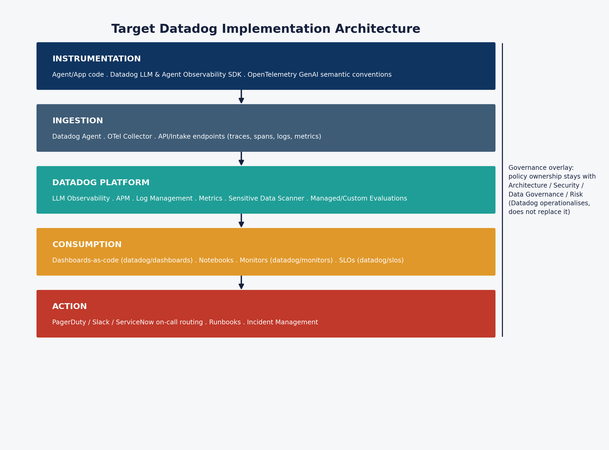
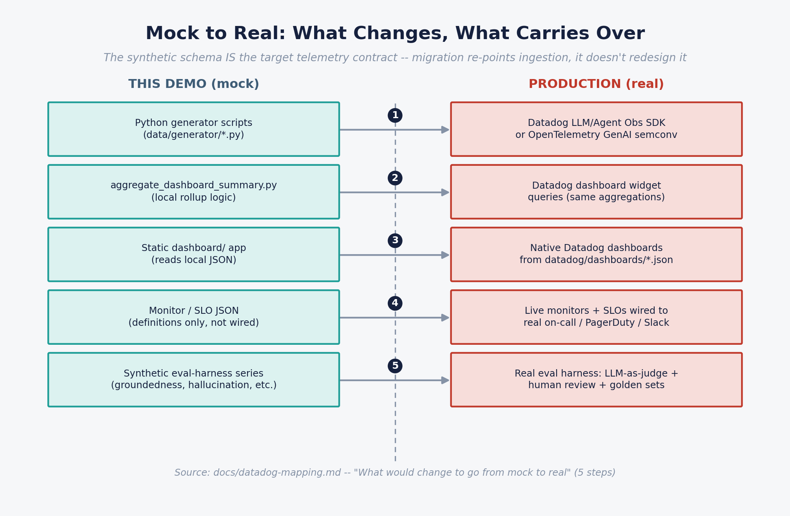

# 5. Datadog APIs, monitors, connectors and implementation reference

This page is the technical bridge from `genai-observability-demo/datadog/` (the migration kit already in this repo) to a real Datadog tenant. Nothing described here is live — these are illustrative dashboards-as-code templates and monitor/SLO definitions, using a proposed metric namespace (`genai.*`) consistent with [`../../docs/datadog-mapping.md`](../../docs/datadog-mapping.md). See the layered architecture diagram below.

## Instrumentation layer — which SDK/API to use

| Approach | When to use it | Notes |
|---|---|---|
| **Datadog LLM Observability SDK** ([docs](https://docs.datadoghq.com/llm_observability/)) | Supported frameworks/providers (OpenAI, Anthropic, Bedrock, Azure OpenAI, LangChain, LangGraph, etc.) | Auto-instruments spans, tokens, cost where supported; fastest path to production |
| **Datadog Agent Observability SDK** | Custom agent orchestration frameworks | Extends LLM Observability to agent-specific spans (planning, tool calls, loops) |
| **OpenTelemetry GenAI semantic conventions** ([spec](https://opentelemetry.io/docs/specs/semconv/gen-ai/)) | Cross-vendor portability preferred, or proprietary/unsupported orchestration | Vendor-neutral; ingested by Datadog via the OTel Collector or Datadog Agent's OTLP intake |
| **Manual spans / custom instrumentation** | Anything auto-instrumentation doesn't cover | Addendum's explicit caveat: auto-instrumentation won't cover proprietary orchestration — budget for this |

The synthetic span taxonomy in this repo (`workflow / llm / retrieval / tool / guardrail`) mirrors the addendum's recommended span taxonomy (`workflow, agent, llm, retrieval, tool, guardrail, human_review, final_response`), so migrating the generator's field names into either SDK or OTel is a direct mapping exercise, not a redesign.

## Proposed metric namespace (`genai.*`)

| Metric | Type | Key tags |
|---|---|---|
| `genai.workflow.count` | count | `outcome, use_case, tenant, channel, risk_tier` |
| `genai.workflow.latency_ms` | distribution | `use_case, tenant` |
| `genai.workflow.cost_usd` | distribution | `use_case, tenant, cost_category` (`llm`\|`tool`\|`retrieval`) |
| `genai.llm.call.count` | count | `provider, model, status, finish_reason` |
| `genai.llm.latency_ms` | distribution | `provider, model` |
| `genai.llm.tokens` | distribution | `provider, model, token_type` (`input`\|`output`) |
| `genai.tool.call.count` | count | `tool_name, risk_class, status` |
| `genai.tool.latency_ms` | distribution | `tool_name` |
| `genai.guardrail.decision.count` | count | `policy_name, allow_block_escalate, reason_code` |
| `genai.incident.count` | count | `severity, root_cause_category` |
| `genai.workflow.step_count` | distribution | `use_case, tenant` |
| `genai.retrieval.count` | count | `retriever, hit (bool)` |
| `genai.retrieval.source_freshness_days` | distribution | `retriever` |
| `genai.eval.groundedness_score` | gauge | `use_case` — from evaluation harness, not raw traces |
| `genai.eval.citation_accuracy_score` | gauge | `use_case` — from evaluation harness |
| `genai.eval.hallucination_flag` | count | `use_case` — from evaluation harness |
| `genai.eval.abstention_flag` | count | `use_case` — from evaluation harness |
| `genai.eval.regression_pass_rate` | gauge | `artefact` (`prompt`\|`model`) — from scheduled eval run |
| `genai.eval.golden_set_accuracy` | gauge | `artefact` — from scheduled eval run |
| `genai.release.event` | count | `event_type` (`release`\|`rollback`), `artefact, from_version, to_version` |
| `genai.release.active_prompt_version` | gauge (tag value) | `use_case` |

Treat this list as a starting convention, not a fixed spec — LLM Observability auto-generates many equivalent metrics natively; the `genai.*` names above are for custom metrics where auto-instrumentation doesn't reach.

## Dashboards-as-code

`datadog/dashboards/` contains one JSON template per dashboard in the 7-dashboard pack, each flagged `"status": "implemented_in_demo"` and matching the 7 tabs in the static app:

| File | Dashboard |
|---|---|
| `ai-executive-health.json` | AI Executive Health |
| `ai-engineering-operations.json` | AI Engineering Operations |
| `ai-security-responsible-ai.json` | AI Security and Responsible AI |
| `ai-cost-and-capacity.json` | AI Cost and Capacity |
| `agent-behaviour-and-agency.json` | Agent Behaviour and Agency — carries a `"caveat"` field: single-agent scenario, multi-agent handoff metrics out of scope |
| `rag-and-grounding-quality.json` | RAG and Grounding Quality — carries a caveat that groundedness/citation/hallucination scores are eval-harness output, not raw-span-derived |
| `ai-release-and-evaluation.json` | AI Release and Evaluation |

**Import path:** Datadog UI → "Import dashboard JSON", or programmatically via Terraform's `datadog_dashboard` resource, or the [Dashboards API](https://docs.datadoghq.com/api/latest/dashboards/).

## Monitors

`datadog/monitors/` holds five illustrative alert definitions, each tagged with its source clause in the addendum §8:

| Monitor | Trigger | Severity routing |
|---|---|---|
| `workflow-success-rate.json` | Success rate < 98% (1h rolling) for low/medium-risk workflows | `@pagerduty-genai-oncall` |
| `rate-limit-error-rate.json` | Sustained provider rate-limit spike | Platform engineering on-call |
| `agent-loop-fanout.json` | >25 loop/replanning events in 15 min (warning at 15) | `@pagerduty-genai-oncall` — reliability *and* cost-risk event |
| `high-risk-action-without-approval.json` | Any high-risk guardrail bypass (zero-tolerance, threshold = 0) | `@security-oncall @pagerduty-genai-oncall`, tagged `severity:sev1` |
| `sensitive-data-egress.json` | Any confirmed sensitive-data egress event (zero-tolerance) | Security/compliance on-call |

**Import path:** Monitors API or `datadog_monitor` Terraform resource. Each JSON's `notify` targets are placeholders (`@pagerduty-genai-oncall`, `@security-oncall`) — these need to be re-pointed to real on-call routing before going live.

## SLOs

`datadog/slos/` defines SLO objects that reference the monitors above as time-slices:

| SLO | Target | Notes |
|---|---|---|
| `workflow-success-rate.json` | ≥98% (30d), warning at 99% | Business-outcome success (resolved + escalated_human) / total, not HTTP-200 |
| `p95-latency.json` | Use-case specific | Separate targets needed for interactive chat vs. batch agent workflows |

## What "connectors" means in this context

There is no single "Datadog connector" — the connection points are:

- **Ingestion**: Datadog Agent (host-based) or OpenTelemetry Collector (`otlp` receiver → Datadog exporter), or direct API/intake endpoints for traces, spans, logs and metrics.
- **Alerting egress**: Datadog's native integrations to PagerDuty, Slack, ServiceNow, Microsoft Teams, email and webhooks — configured once, referenced by name in every monitor's `notify` field.
- **Governance tooling**: Sensitive Data Scanner (built into the platform, not a separate connector) for real prompt/output content once actual data is being logged.
- **Evaluations**: Datadog Managed Evaluations (for supported patterns) or Custom Evaluations (bring-your-own LLM-as-judge/scoring pipeline) — this is the piece this demo cannot mock convincingly, per [`03-architecture-and-caveats.md`](03-architecture-and-caveats.md).

## Five-step migration checklist (mock → real)

See the mock-to-real migration diagram below.

1. Replace `data/generator/*.py` with actual SDK/OTel instrumentation emitting the same field names into Datadog.
2. Replace `data/generator/aggregate_dashboard_summary.py` with real Datadog dashboard queries — the aggregation logic (daily P95, cost/successful-workflow, etc.) becomes the widget query definitions already drafted in `datadog/dashboards/`.
3. Replace the static `dashboard/` app with native Datadog dashboards built from `datadog/dashboards/*.json` — or keep the static app as an executive-facing summary view fed by the Datadog API instead of the local JSON file.
4. Wire `datadog/monitors/*.json` and `datadog/slos/*.json` to real alert channels.
5. Stand up an actual evaluation harness (Datadog Managed/Custom Evaluations, an LLM-as-judge pipeline, golden sets, human review sampling) to produce the RAG/Grounding and Release/Evaluation tabs' numbers for real.
